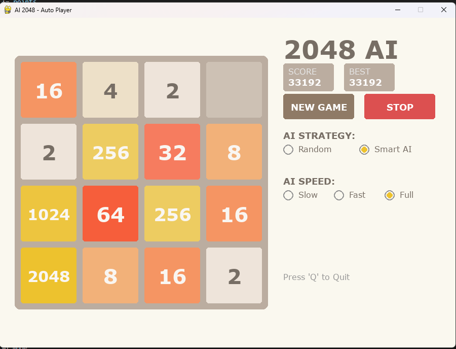

# 🎮 AI 2048 Auto-Player

> Đồ án môn học Trí Tuệ Nhân Tạo
> Hệ thống tự động chơi game 2048 sử dụng thuật toán Expectimax và Heuristic nâng cao.


_(Hình ảnh minh họa giao diện game)_

## 🌟 Tính năng nổi bật

- **Game Engine:** Tự xây dựng logic 2048 và giao diện đồ họa bằng **Pygame**.
- **AI Algorithm:** Sử dụng thuật toán **Expectimax** (độ sâu tùy chỉnh) để xử lý yếu tố ngẫu nhiên của game.
- **S-Rank Optimization:**
  - **Transposition Table:** Kỹ thuật lưu vết (Caching) giúp tránh tính toán lặp lại.
  - **Heuristics:** Đánh giá bàn cờ dựa trên 4 tiêu chí: _Monotonicity, Smoothness, Free Tiles, Max Value_.
- **Giao diện trực quan:**
  - Dashboard điều khiển (Start/Stop/Reset).
  - Tùy chỉnh tốc độ (Slow/Fast/Full).
  - Lưu điểm cao (High Score).
- **Portable:** Chơi ngay không cần cài đặt Python.

---

## 📥 TẢI VÀ CHƠI NGAY (Dành cho Người chơi)

Bạn không cần biết lập trình, chỉ cần tải game về và chơi:

1.  Truy cập mục **[Releases](../../releases)** bên phải giao diện GitHub.
2.  Tải file **`AI_2048_VIP.exe`**.
3.  Bấm đúp vào file để chạy. (Game sẽ tự tạo file `highscore.txt` để lưu điểm của bạn).

---

## 👨‍💻 DÀNH CHO LẬP TRÌNH VIÊN (Dành cho Developer)

Yêu cầu: Python 3.10 trở lên.

1.  **Clone dự án:**

    ```bash
    git clone https://github.com/dangkhoa22002/AI-2048-AutoPlayer.git
    cd AI-2048-AutoPlayer
    ```

2.  **Cài đặt thư viện:**

    ```bash
    pip install -r requirements.txt
    ```

3.  **Chạy game:**
    ```bash
    python main.py
    ```

## 🎮 Hướng dẫn sử dụng

- **Chế độ Người chơi:** Sử dụng các phím mũi tên `⬅️` `➡️` `⬆️` `⬇️` để di chuyển.
- **Chế độ AI:**
  - Chọn **"Smart AI"** trên bảng điều khiển.
  - Chọn tốc độ (khuyên dùng **Fast** hoặc **Full**).
  - Bấm nút **RUN AUTO**.
- **Thoát game:** Bấm phím `Q` hoặc nút `X` trên cửa sổ.
